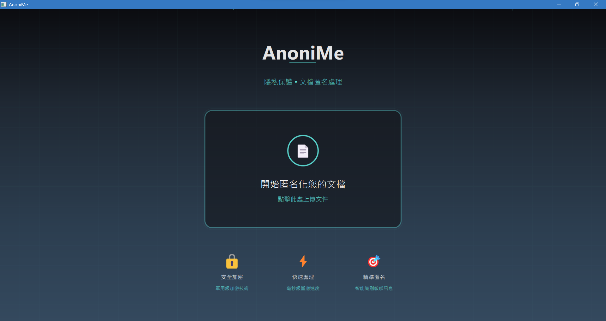

AnoniMe is a tool specifically designed to protect Personally Identifiable Information (PII) in documents. Many people, without privacy protection, accidentally upload files containing sensitive information such as names, phone numbers, and addresses to AI tools or third-party platforms, and this data may be misused.

If you manually redact the information, it is not only time-consuming but also cumbersome due to different file formats (txt, docx, pdf), and it is easy to miss something. In fact, not all data needs to be completely de-identified, so AnoniMe provides customizable rules to anonymize where necessary, saving time and reducing risks.
To make anonymized documents closer to real-world scenarios, AnoniMe integrates the Kuwa GenAI OS Llama 3.1 8B @ NPU model, which can automatically generate context-aware fake data, ensuring that processed documents remain natural and fluent, suitable for subsequent analysis and applications.

## Maintainers

| Name | Email | GitHub |
|------|-------|--------|
| 林佳蓁 | linjiazhen012815@gmail.com | <a href="https://github.com/penpenpenguin"></a> |
| 吳承軒 | dsw1328201@gmail.com | <a href="https://github.com/tonywuwutony"></a> |
| 褚家豪 | lucasauriant0209@gmail.com | <a href="https://github.com/Lucas-Chu-0209"></a> |

## Project Structure (Organization)
- app — Main program and (optional) backend
  - app/run_with_test_backend.py — Main program entry (start process)
  - app/backend/ — Backend service endpoints

- core：Anonymization core and pipeline
  - pii_models/ — Custom recognizers and rules（e.g., custom_recognizer.py、custom_recognizer_plus.py）
  - faker_models/ — Replacement strategies and mapping cache（e.g., presidio_replacer_plus.py、muiltAI_pii_replace.py）

- communication：Communication with external services/models
  - faker_models/muiltAI_pii_replace.py — Connects to chat model through KuwaClient to batch-generate replacement strings
  - app/backend/ — Backend service endpoints (if needed for frontend or external integration)

- handlers：File handlers
  - file_handlers/ — Extraction and writing for text, Word, PDF formats (txt_handler.py, docx_handler.py, pdf_handler.py)

- userinterface：User interface resources
  - qml/ — QML interface and resources (for desktop or embedded UI)


## Usage (Installation and Operation)
AnoniMe works together with Kuwa GenAI OS (kuwa-aios), and uses the Llama 3.1 8B @ NPU model to automatically generate or replace fake data in documents, ensuring anonymized content remains realistic.

> ⚠️ Notes 
> - For installation and usage of Kuwa GenAI OS, please refer to the official documentation. This project does not repeat those instructions.
> - "This project currently uses the NPU model, so devices with NPU support are required." 
> - "If your environment does not support NPU, it is recommended to use other models that do not rely on NPU."

### .env 檔案
Please create a .env file in the project root directory, example as follows:
```env
# Your Kuwa server address
KUWA_BASE_URL=http://127.0.0.1

# User API Token created/copied in the Kuwa backend
KUWA_API_KEY= <API Token>

# Model name seen in Kuwa “Model List / Bot Settings”, just replace the following Llama 3.1 8B @ NPU
KUWA_MODEL=.bot/Llama 3.1 8B @NPU
```

### Kuwa Client Path Setup
Since KuwaClient is not currently provided via pip install, but is directly imported from Kuwa GenAI OS source code, you need to manually specify the path.

Open faker_models/muiltAI_pii_replace.py and find the following code block:
```python
import sys
sys.path.append(r"C:\kuwa\GenAI OS\src\library\client\src\kuwa") # Modify according to your actual path
from client.base import KuwaClient
```

## Quick Start
- Create a virtual environment and install dependencies (recommended 3.11 / 3.10)
- Run KUWA
- pip install -r requirements.txt     # Install required packages
- python app/run_with_test_backend.py


## License
This project is licensed under the GNU GPLv3 License for open-source use.  
For commercial licensing, please contact linjiazhen012815@gmail.com .