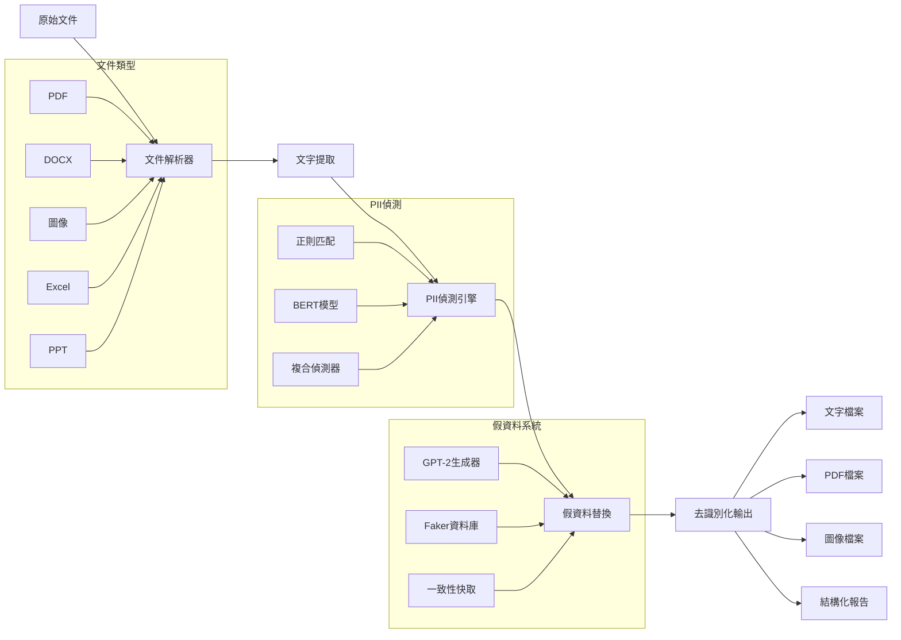
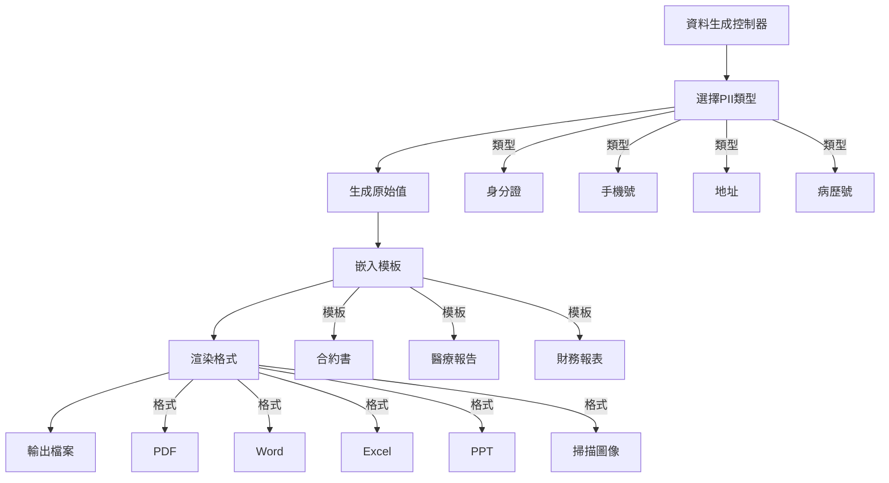
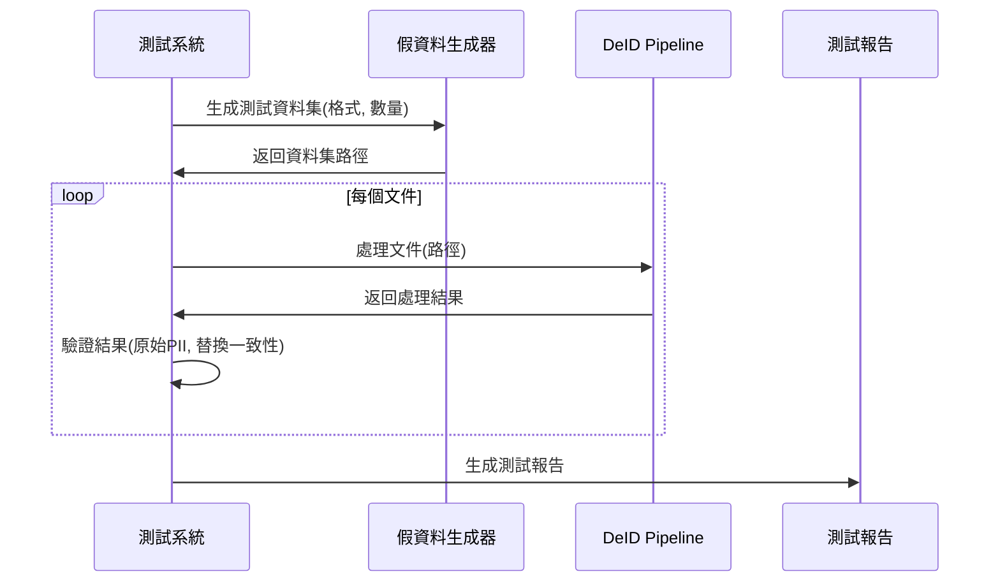

## Chinese

### 專案概述
AnoniMe 是一款桌面文件去識別化應用程式，能自動檢測並替換文件中的個人識別資訊（PII）。採用 PySide6 和 QML 建構，提供友善的使用者介面來處理 TXT、DOCX 和 PDF 檔案，同時保持文件結構和格式。

### 主要功能
- **多格式支援**：處理 TXT、DOCX 和 PDF 檔案
- **進階 PII 檢測**：基於 Microsoft Presidio 並結合台灣特有識別器
- **智慧替換**：使用 Faker 函式庫進行上下文感知的假資料生成
- **文件預覽**：內建處理後文件的預覽功能
- **多語言支援**：支援中英文語言處理

### 架構說明

```
AnoniMe/
├── main.py                    # 主程式進入點
├── Main.qml                   # QML 使用者介面主視窗
├── HomePage.qml               # 首頁介面
├── UploadPage.qml            # 檔案上傳介面
├── ResultPage.qml            # 結果顯示介面
├── EmbedViewer.qml           # 文件預覽元件
├── test_backend.py           # 增強版後端含預覽功能
├── pii_models/               # PII 檢測模組
│   ├── presidio_detector.py  # 核心 PII 檢測引擎
│   ├── custom_recognizer_plus.py # 台灣特有識別器
│   └── detector.py           # 檢測工具
├── faker_models/             # 資料替換模組
│   ├── presidio_replacer.py  # 主要替換引擎
│   └── tony_faker.py         # 自訂假資料產生器
├── file_handlers/            # 檔案處理模組
│   ├── txt_handler.py        # 文字檔處理器
│   ├── docx_handler.py       # Word 文件處理器
│   └── pdf_handler_1.py      # PDF 處理器
└── scripts/                  # 工具腳本
    └── minimal_text_demo.py  # 示範腳本
```

### 核心技術

#### PII 檢測管線
```python
# presidio_detector.py - 多語言 PII 檢測
from presidio_analyzer import AnalyzerEngine, RecognizerRegistry
from presidio_analyzer.nlp_engine import NlpEngineProvider

nlp_config = {
    "nlp_engine_name": "spacy",
    "models": [
        {"lang_code": "en", "model_name": "en_core_web_sm"},
        {"lang_code": "zh", "model_name": "zh_core_web_sm"},
    ],
}

provider = NlpEngineProvider(nlp_configuration=nlp_config)
nlp_engine = provider.create_engine()
analyzer = AnalyzerEngine(nlp_engine=nlp_engine, supported_languages=["en", "zh"])
```

#### 台灣自訂識別器
```python
# custom_recognizer_plus.py - 台灣特有實體識別
def validate_tw_ubn(ubn: str) -> bool:
    """台灣統一編號檢驗器"""
    if not re.fullmatch(r"\d{8}", ubn):
        return False
    coef = [1,2,1,2,1,2,4,1]
    s = 0
    for i, c in enumerate(ubn):
        p = int(c) * coef[i]
        s += (p // 10) + (p % 10)
    return s % 10 == 0 or (s + 1) % 10 == 0

# 支援的台灣實體：
# - 身分證字號
# - 統一編號（公司行號）
# - 台灣電話號碼
# - 網路卡位址
```

#### 智慧資料替換
```python
# presidio_replacer.py - 上下文感知假資料生成
from presidio_anonymizer import AnonymizerEngine
from faker import Faker

def replace_pii(text, analyzer_results):
    """將檢測到的 PII 替換為符合上下文的假資料"""
    anonymizer = AnonymizerEngine()
    
    # 台灣特有實體的自訂操作器
    operators = {
        "TW_ID": OperatorConfig("custom", {"lambda": fake_tw_id}),
        "TW_UBN": OperatorConfig("custom", {"lambda": fake_ubn}),
        "PHONE_NUMBER": OperatorConfig("custom", {"lambda": fake_phone}),
    }
    
    return anonymizer.anonymize(
        text=text,
        analyzer_results=analyzer_results,
        operators=operators
    )
```

### API 契約

#### 輸入 JSON 結構
```json
{
  "file_path": "檔案路徑字串",
  "language": "en|zh|auto",
  "options": {
    "name": true,
    "email": true,
    "phone": true,
    "id_number": true,
    "address": true
  }
}
```

#### 輸出 JSON 結構
```json
{
  "status": "success|error",
  "original_file": "原始檔案路徑",
  "processed_file": "處理後檔案路徑",
  "preview_file": "預覽檔案路徑",
  "entities_found": [
    {
      "entity_type": "實體類型",
      "text": "匹配文字",
      "start": "起始位置",
      "end": "結束位置",
      "confidence": "信心分數"
    }
  ],
  "processing_time": "處理時間（秒）",
  "error_message": "錯誤訊息"
}
```

### 安裝與使用

#### 環境需求
```bash
pip install PySide6 presidio-analyzer presidio-anonymizer spacy faker PyMuPDF python-docx
python -m spacy download en_core_web_sm
python -m spacy download zh_core_web_sm
```

#### 執行應用程式
```bash
# 標準模式
python main.py

# 增強模式含預覽功能
python run_with_test_backend.py
```

#### 最小測試腳本
```bash
python scripts/minimal_text_demo.py
```

### 測試
```bash
# 執行完整測試
python simple_test.py

# 測試特定檔案處理器
python test_file_routing.py

# 後端功能測試
python test_backend.py
```

---

## Dependencies | 相依套件

- **PySide6**: Desktop application framework | 桌面應用程式框架
- **Microsoft Presidio**: PII detection and anonymization | PII 檢測與匿名化
- **spaCy**: Natural language processing | 自然語言處理
- **Faker**: Fake data generation | 假資料生成
- **PyMuPDF**: PDF processing | PDF 處理
- **python-docx**: Word document processing | Word 文件處理

## License | 授權
This project is licensed under the MIT License | 本專案採用 MIT 授權條款
  - `start: int`, `end: int` — 原文中的字元起迄位置
  - `score: float` — 信心分數
  - `raw_txt: str` — 原始片段

- 傳回給 QML 的後端結果（`resultsReady` 中每個元素）：
  - `fileName: str` — 輸出檔名
  - `type: "text" | "docx" | "pdf" | "binary"`
  - `originalText: str` —（可選）原文預覽
  - `maskedText: str` —（可選）替換後文字預覽
  - `embedData: object` — 供 `EmbedViewer.qml` 使用的預覽資料，例如：
    - 文字：`{ viewType: "text", content: str, syntaxType: str, lineCount: int }`
    - PDF：`{ viewType: "pdf", pageImages: string[], pageCount: int, metadata?: object }`
  - `outputPath?: str` — 去識別化後檔案的絕對路徑

- 文字處理器 API：
  - `TextHandler.deidentify(input_path: str, output_path: str, language: str = "auto") -> str`
  - 回傳實際寫入完成的 `output_path`。

快速示範（中文）：

```powershell
python scripts/minimal_text_demo.py --mode detect-replace
python scripts/minimal_text_demo.py --mode file
```
- UI：PySide6 + QML（`Main.qml`/`HomePage.qml`/`UploadPage.qml`/`ResultPage.qml`）
- 後端：`main.py`（正式流程）與 `test_backend.py`（預覽強化版）
- PII 偵測：Microsoft Presidio（spacy 多語）+ 自訂辨識器
- 假資料替換：Presidio Anonymizer + Faker；PDF 另含一組 Faker 替換管線

## 目錄總覽

```
.
├─ main.py                         # 正式 Backend（檔案路由、預覽資料、轉檔）
├─ run_with_test_backend.py        # 啟動 QML + 測試後端
├─ test_backend.py                 # 測試 Backend：統一產生 PDF 預覽與頁圖回傳
├─ Main.qml / HomePage.qml / UploadPage.qml / ResultPage.qml / EmbedViewer.qml / MaskCheckBox.qml
├─ file_handlers/                  # 各格式處理器
│  ├─ txt_handler.py               # 純文字偵測→替換→輸出
│  ├─ docx_handler.py              # 遍歷 runs、表格 cells 偵測→替換→輸出 DOCX
│  ├─ pdf_handler.py               # 逐 span 偵測→替換→輸出 PDF
│  └─ pdf_handler_1.py             #（變體）使用 faker mapping 替換
│
├─ pii_models/                     # PII 偵測
│  ├─ presidio_detector.py         # Presidio AnalyzerEngine（spacy 多語）+ detect_pii()
│  ├─ custom_recognizer_plus.py    # 台灣常見：身分證/統編/手機/市話/MAC/健保卡…（regex + context + 校驗）
│  ├─ custom_recognizer.py         # 精簡自訂識別器版本
│  └─ detector.py                  # spacy + regex 的另一條路（未進主流程）
│
├─ faker_models/                   # 假資料替換
│  ├─ presidio_replacer.py         # Presidio Anonymizer + Faker（以 entity type 決定替換策略）
│  └─ tony_faker.py                # 依偵測結果產生對應假值、取最高分、映射替換
├─ scripts/                        # 單檔測試腳本
│  ├─ run_txt_file.py
│  ├─ run_docx_file.py
│  └─ run_pdf_file.py
│
└─ test_output/                    # 處理結果與預覽
  ├─ *_deid.(txt|docx|pdf)
  └─ _previews/ ...
```

## 安裝與執行（Windows, PowerShell）

> 需求重點：Python 3.10+、pip；建議安裝 `en_core_web_sm` 與 `zh_core_web_sm` spacy 模型。PDF 預覽使用 PyMuPDF，不需額外字型。

1) 建立環境與安裝套件

```powershell
python -m venv .venv
2) 啟動（建議先用測試後端，預覽最穩定）

```powershell
# 使用測試後端：統一將結果轉成 PDF + 頁圖回傳到前端
python run_with_test_backend.py
3) 正式後端（若你的環境有 Word 或 LibreOffice，可用較貼近正式流程的轉檔）

<<<<<<< HEAD
```powershell
python main.py
- DOCX→PDF 預覽策略：
  - Windows + Word（pywin32 COM）優先；
  - 失敗則嘗試 LibreOffice（將 `soffice.exe` 加入 PATH 或以環境變數 `SOFFICE_PATH` 指定）。
- PDF handler 中若有硬編碼字型路徑（macOS 範例），請改為系統可用字型或使用標準字型名（如 `helv`）。

## 使用流程與 UI

- 在 `UploadPage` 拖放或選取檔案，勾選要處理的項目（姓名/Email/電話/ID…），按「生成結果」。
- 後端把檔案路由到 `file_handlers/*_handler.py`，偵測→替換→輸出到 `test_output/`。
- 前端顯示處理後檔案的 PDF 頁圖或文字預覽（`EmbedViewer.qml`）。

## PII 偵測與假資料替換（核心設計）

本專案對文字、DOCX、PDF 都使用「先偵測 span，再替換」的策略：

- 偵測：`pii_models/presidio_detector.py` 建立 Presidio `AnalyzerEngine`，載入 `en_core_web_sm` / `zh_core_web_sm`，並呼叫 `custom_recognizer_plus.register_custom_entities()` 註冊台灣常見 PII 識別規則（含校驗與語境強化）。
- 替換：
  - 文字/DOCX：`faker_models/presidio_replacer.py` 以 Presidio Anonymizer + Faker，依 `entity_type` 提供合理假值或遮蔽。
  - PDF：`file_handlers/pdf_handler_1.py` 會先以 `tony_faker.py` 針對偵測結果產生假值 mapping，再依 span 定位替換文字，保持原座標與字級。

### Detect：`pii_models/presidio_detector.py`

```python
# 建立 spacy 多語引擎 + Presidio Analyzer
nlp_config = {
  "nlp_engine_name": "spacy",
  "models": [
    {"lang_code": "en", "model_name": "en_core_web_sm"},
    {"lang_code": "zh", "model_name": "zh_core_web_sm"},
  ],
}
provider = NlpEngineProvider(nlp_configuration=nlp_config)
nlp_engine = provider.create_engine()

analyzer = AnalyzerEngine(
  nlp_engine=nlp_engine,
  supported_languages=["en", "zh"]
)

# 註冊自訂實體（台灣身分證、統編、手機/市話、MAC、健保卡…）
register_custom_entities(analyzer)

def detect_pii(text: str, language: str = "auto", score_threshold: float = 0.5):
  results = analyzer.analyze(text=text, entities=None, language=language)
  # 整理為統一 dict 格式（含 raw_txt）
  filtered = []
  for r in results:
    if r.score >= score_threshold:
      filtered.append({
                "entity_type": r.entity_type,
                "start": r.start,
                "end": r.end,
        "score": r.score,
        "raw_txt": text[r.start:r.end]
      })
  return filtered
```

重點：
- `register_custom_entities` 加強台灣特有實體（例如統編含校驗、手機支援 +886 多種格式、MAC 正規化與低質特例降分）。
- 回傳為統一 dict，後續替換端可以不依賴 Presidio 的物件型別。

### Custom Recognizers：`pii_models/custom_recognizer_plus.py`

```python
# 以 PatternRecognizer + context/validator 強化：
# - UNIFIED_BUSINESS_NO：校驗合法統編後拉高信心，否則壓低
# - TW_PHONE_NUMBER：支援國際/本地多種格式（+886, 09xx-xxx-xxx, ...）
# - TW_HOME_NUMBER：市話（含括號/破折/國碼）
# - MAC_ADDRESS：支援冒號、破折、Cisco dotted；00..00 等例外降分
# - TW_NHI_NUMBER：健保卡（以 context 避免誤擊）

for lang in ("zh", "en"):
  analyzer.registry.add_recognizer(tw_id_recognizer)
  analyzer.registry.add_recognizer(tw_ubn_recognizer)
  analyzer.registry.add_recognizer(tw_phone_recognizer)
  analyzer.registry.add_recognizer(tw_home_recognizer)
  analyzer.registry.add_recognizer(mac_recognizer)
  analyzer.registry.add_recognizer(tw_nhi_recognizer)
```

重點：
- 以 context（關鍵字上下文）降低一般數字串誤判。
- UBN 透過 checksum 驗證控制分數，提升精確度。

### Replace（文字/DOCX）：`faker_models/presidio_replacer.py`

```python
from presidio_anonymizer import AnonymizerEngine
from presidio_anonymizer.entities import OperatorConfig
from presidio_analyzer import RecognizerResult
from faker import Faker

anonymizer = AnonymizerEngine()
fake = Faker()

def replace_pii(text: str, analyzer_results: list[dict]) -> str:
  # 將偵測結果（dict）轉 Presidio RecognizerResult
  recognizer_results = [
    RecognizerResult(
      entity_type=r["entity_type"], start=r["start"], end=r["end"], score=r["score"]
    ) for r in analyzer_results
  ]

  # 依 entity 決定替換策略（示意）
  operators = {
    "EMAIL_ADDRESS": OperatorConfig("replace", {"new_value": "user@example.com"}),
    "PHONE_NUMBER": OperatorConfig("replace", {"new_value": fake.phone_number()}),
    "PERSON":       OperatorConfig("replace", {"new_value": fake.name()}),
    "LOCATION":     OperatorConfig("replace", {"new_value": fake.address()}),
    "IP_ADDRESS":   OperatorConfig("replace", {"new_value": fake.ipv4()}),
    "CREDIT_CARD":  OperatorConfig("replace", {"new_value": fake.credit_card_number()}),
    # 台灣常見：
    "TW_ID_NUMBER":         OperatorConfig("replace", {"new_value": _fake_tw_id()}),
    "UNIFIED_BUSINESS_NO":  OperatorConfig("replace", {"new_value": _fake_ubn()}),
    "TW_PHONE_NUMBER":      OperatorConfig("replace", {"new_value": _fake_tw_mobile()}),
    # 其他未知型別：保留原文或以『★』遮蔽
  }

  return anonymizer.anonymize(
    text=text, analyzer_results=recognizer_results, operators=operators
  ).text
```

重點：
- 使用 Presidio Anonymizer 的 OperatorConfig，以「替換」為主，也可改 mask。
- 對地區特有（TW）提供專屬產生器，以保持格式合理性。

### Replace（PDF）：`file_handlers/pdf_handler_1.py`

```python
# 逐頁逐 span：先 detect，再用 faker 生成對應 fake_map，依原起訖位置替換文字，
# 並維持原有 bbox / 字級，最後以 PyMuPDF 重建新 PDF。
entities = detect_pii(text, language="en", score_threshold=0.6)
faker_results = test_all_methods(entities)
best_results = keep_highest_score_per_raw_txt(faker_results)
fake_map = {item["raw_txt"]: item["fake_value"] for item in best_results}

masked_text = text
offset = 0
for ent in entities:
  start, end = ent["start"] + offset, ent["end"] + offset
  raw_txt = ent["raw_txt"]
  fake_value = fake_map.get(raw_txt, "*" * (end - start))
  fake_value = fake_value[:len(raw_txt)].ljust(len(raw_txt))
  masked_text = masked_text[:start] + fake_value + masked_text[end:]
  offset += len(fake_value) - (end - start)
```

重點：
- 以 `offset` 處理替換後長度差，避免後續 span 位置錯位。
- 具體替換策略可插拔：可改為全遮蔽或按類型產值得更精細。

## 後端路由與輸出

`main.Backend._process_file_with_deidentification()` 依副檔名路由：

- text → `TextHandler.deidentify()` → `*_deid.txt`
- docx → `DocxHandler.deidentify()` → `*_deid.docx`
- pdf → `PdfHandler.deidentify()` → `*_deid.pdf`

預覽：
- PDF 直接轉頁圖（PyMuPDF）。
- DOC/DOCX 嘗試轉 PDF 再轉頁圖；若無 Word/LibreOffice，改為 unsupported 訊息。
- TXT 直接提供內容預覽（行號/語法色底）。

## 常見問題（FAQ）

- spacy 模型下載錯誤？請確認網路或改用離線安裝，確保 `en_core_web_sm`、`zh_core_web_sm` 可用。
- PDF handler 出現字型路徑錯誤？將硬編碼字型改為本機可用檔案，或簡化為標準字型名 `helv`/`times`。
- DOCX→PDF 轉檔失敗？
  - Windows + Word（pywin32）較穩定；
  - 無 Word 時請安裝 LibreOffice，並將 `soffice.exe` 加入 PATH 或以 `SOFFICE_PATH` 指定。

## 授權

此專案包含第三方套件（Presidio、spaCy、PyMuPDF、Faker 等），其授權條款請依原專案為準。

# EdgeDeID Studio

EdgeDeID Studio is a real-time, on-device personal data anonymization toolkit that detects and redacts sensitive information (PII) from PDF documents, images, and tabular data within **150 ms**.

## ✨ Features

- 🔍 **NER + OCR PII Detection**: Identifies names, emails, addresses, ID numbers, and more.
- 🧠 **Generative AI Augmentation**: Replace redacted info with synthetic names, or generate summaries.
- 📄 **Document Support**: Works with PDF, image, and CSV/Excel files.
- ⚡ **Edge-Optimized**: Quantized ONNX models run on Qualcomm Copilot+ NPU with <150ms latency.
- 🛡️ **Privacy-First**: Everything runs locally. No data leaves the device.

## 🧰 Tech Stack

- **NER model**: `ckiplab/bert-base-chinese-ner`
- **Fake data generation**: `uer/gpt2-chinese-cluecorpussmall`
- **PDF/Image parsing**: `PyMuPDF`, `Pillow`, `pandas`
- **ONNX Inference**: `onnx`, `onnxruntime`, `onnxsim`
- **UI**: PySide6 (for graphical interface)

## 🗂️ Project Structure

## PII Models
"""
```

### 🧰 [predidio](https://github.com/microsoft/presidio)
#### [Demo](https://huggingface.co/spaces/presidio/presidio_demo)

- Data Protection and De-identification SDK
- 效果佳

#### 難點
- 多種語言難一次偵測(除非直接使用多語 PII NER 模型偵測)
- Spacy 一次只能偵測一種語言 (需要多次呼叫 -> 效能 bad bad | 使用者端預先選擇 input file 的語言)

### 🧰 [Multilingual NER](https://huggingface.co/Babelscape/wikineural-multilingual-ner)
- mBERT multilingual language model
- model is trained on WikiNEuRal (Therefore, it might not generalize well to all textual genres (e.g. news))

### 🧰 [xlm-roberta-base-ner-hrl](https://huggingface.co/Davlan/xlm-roberta-base-ner-hrl)
- based on a fine-tuned XLM-RoBERTa base model

### 🧰 [piiranha-v1-detect-personal-information](https://huggingface.co/iiiorg/piiranha-v1-detect-personal-information)
- open in Colab 可以直接實測
-

下面彙整從最初到目前，我們在 **EdgeDeID Studio** 專案中所實作的全部功能、檔案結構與測試策略，並說明每個模組如何串接成「去識別化＋替換假資料」的完整流程，以及我們如何生成＆應用敏感假資料。

---

## 一、專案目錄總覽

```
/
├── configs/
│   └── regex_zh.yaml                   # 中文正則規則
│
├── models/                             # 原始 Hugging Face 模型快取
│   ├── ner/bert-ner-zh/
│   └── gpt2/
│
├── edge_models/
│   └── bert-ner-zh.onnx                # ONNX 格式 NER 模型
│
├── scripts/                            # 各種工具腳本
│   ├── download_models.py              # 一鍵下載 HF 模型
│   ├── run_automated_pipeline.py       # 自動化測試管線
│   ├── benchmark_formats.py            # 格式效能基準測試
│   └── validate_quality.py             # 去識別化品質驗證
│
├── examples/                           # 使用範例
│   ├── usage_examples.py               # 基本 & 批量資料生成示範
│   └── advanced_usage.py               # 進階使用範例
│
├── sensitive_data_generator/           # 假資料生成子系統
│   ├── __init__.py                     # 套件匯出介面
│   ├── config.py                       # 地區、街道、姓名、醫院等設定
│   ├── generators.py                   # 各類 PII Generator
│   ├── formatters.py                   # 基本段落 & 文件模板
│   ├── advanced_formatters.py          # 進階合約／醫療報告／財務報表模板
│   ├── file_writers.py                 # 基本 TXT/PDF/Image/CSV/JSON 輸出
│   ├── advanced_file_writers.py        # 進階 PDF/Word/Excel/PPT/掃描檔輸出
│   └── dataset_generator.py            # 一鍵產出多格式測試資料集
│
├── src/deid_pipeline/                  # 核心 De-ID Pipeline
│   ├── __init__.py                     # 匯出 DeidPipeline 類
│   ├── config.py                       # Pipeline 全域設定
│   ├── parser/                         # 檔案文字抽取
│   │   ├── ocr.py                      # EasyOCR singleton
│   │   └── text_extractor.py           # PDF/DOCX/Image → 純文字
│   ├── image_deid/                     # 影像去識別化
│   │   └── processor.py                # OCR→Detect→Replace→回寫圖片
│   ├── pii/                            # PII 偵測 & 假資料替換核心
│   │   ├── detectors/                  # 各種偵測器
│   │   │   ├── regex_detector.py
│   │   │   ├── spacy_detector.py
│   │   │   ├── bert_detector.py
│   │   │   ├── bert_onnx_detector.py
│   │   │   └── composite.py            # 多 detector 結果合併
│   │   └── utils/                      # 共用工具
│   │       ├── base.py                 # Entity, PIIDetector 抽象類
│   │       ├── fake_provider.py        # GPT-2 + Faker 假資料產生器
│   │       └── replacer.py             # 文本 & 事件記錄取代邏輯
│
└── tests/                              # 各層測試
    ├── test_data_factory.py            # Faker 測試資料產生
    ├── pii_test_suite.py               # Regex/BERT/Composite/Replacer 單元
    ├── test_detectors.py               # 多 detector 參數化測試
    ├── test_replacer.py                # 替換一致性測試
    ├── test_onnx_speed.py              # ONNX 延遲基準 (<25ms)
    ├── integration_test.py             # extract→detect→replace 整合測
    ├── performance_test.py             # 不同長度文本效能趨勢
    ├── end_to_end_test.py              # TXT/PDF/Image E2E 測試
    └── test_data_generator_integration.py  # 假資料生成器 + Pipeline 整合驗證
```

---

## 環境建置（Environment Setup）

本專案同時提供 Conda 與 Pip 兩種方式建立相同的開發環境。

### 1. 使用 Conda

```bash
# 1) 進入到本專案根目錄
cd path/to/edge-deid-studio

# 2) 建立 conda 環境
conda env create -f env/conda.yaml

# 3) 啟動環境
conda activate edge-deid
````

> **提示**：若環境名稱不是 `edge-deid`，請用 `conda env list` 確認後再切換。

### 2. 使用 Python venv + Pip

```bash
# 1) 進入到本專案根目錄
cd path/to/edge-deid-studio

# 2) 建立 virtualenv
python3 -m venv .venv

# 3) 啟動 venv（Linux/macOS）
source .venv/bin/activate

#    Windows PowerShell
.\.venv\Scripts\Activate.ps1

# 4) 安裝所有相依
pip install --upgrade pip
pip install -r requirements.txt
```

### 3. 確認安裝

```bash
# 測試套件
pytest --maxfail=1 --disable-warnings -q

# 快速檢查
python quick_tests.py

# 嘗試 CLI
python main.py -i test_input/sample.pdf --mode replace --json
```

---

## 二、核心模組與功能

### 1. De-ID Pipeline (`src/deid_pipeline/`)

* **`config.py`**
  管理模型路徑、閾值、OCR 設定、Fake-data 參數、ONNX 開關等。
* **文字抽取 (`parser/`)**

  * `text_extractor.py`：PDF（`fitz`）、DOCX（`python-docx`）、影像（`EasyOCR`）→ 統一 `extract_text()`。
* **影像去識別 (`image_deid/processor.py`)**
  OCR → `get_detector()` 偵測 → `Replacer.replace()` → 塗黑或替換 → 回寫圖片。
* **PII 偵測 & 假資料替換 (`pii/`)**

  * **RegexDetector**：YAML 規則 → `re.finditer`。
  * **SpaCyDetector**：spaCy NER + regex 補正。
  * **BertDetector**、**BertONNXDetector**：Sliding window → Transformer 推論。
  * **Composite**：依 `ENTITY_PRIORITY` 整合多檢測器結果。
  * **FakeProvider**：GPT-2 + Faker fallback 生成假值。
  * **Replacer**：依 span 在原文替換或塗黑，並記錄事件。

整合成 `DeidPipeline.process(input)` → 回傳 `DeidResult(entities, output, report)`。

### Config.py 參數範例

```python
# src/deid_pipeline/config.py

# 1. 規則檔路徑
PROJECT_ROOT   = Path(__file__).resolve().parent.parent
CONFIGS_DIR    = PROJECT_ROOT / "configs"
REGEX_RULES_FILE = CONFIGS_DIR / "regex_zh.yaml"

def load_regex_rules(path: Path = REGEX_RULES_FILE) -> dict:
    with open(path, encoding="utf-8") as f:
        return yaml.safe_load(f)

class Config:
    """全域設定中心：文字抽取／PII 偵測／假資料生成"""

    # 支援檔案類型
    SUPPORTED_FILE_TYPES = [".pdf", ".docx", ".png", ".jpg"]

    # --- 文字抽取設定 ---
    OCR_ENABLED      = True
    OCR_THRESHOLD    = 50
    OCR_LANGUAGES    = ["ch_tra", "en"]

    # --- BERT 偵測設定 ---
    NER_MODEL_PATH          = os.getenv("NER_MODEL_PATH", PROJECT_ROOT / "models" / "ner")
    BERT_CONFIDENCE_THRESHOLD = 0.85
    MAX_SEQ_LENGTH          = 512
    WINDOW_STRIDE           = 0.5
    ENTITY_PRIORITY = {
        "TW_ID": 100,
        "PASSPORT": 95,
        "PHONE": 85,
        "EMAIL": 80,
        "NAME": 75,
        "ADDRESS": 70,
    }

    # --- Regex 規則 ---
    REGEX_PATTERNS = load_regex_rules()

    # --- 假資料生成 ---
    GPT2_MODEL_PATH   = os.getenv("GPT2_MODEL_PATH", PROJECT_ROOT / "models" / "gpt2")
    FAKER_LOCALE      = "zh_TW"
    FAKER_CACHE_SIZE  = 1000

    # --- ONNX Runtime 推論 ---
    USE_ONNX         = True
    ONNX_MODEL_PATH  = os.getenv("ONNX_MODEL_PATH", PROJECT_ROOT / "edge_models" / "bert-ner-zh.onnx")
    ONNX_PROVIDERS   = ["CPUExecutionProvider","CUDAExecutionProvider","NPUExecutionProvider"]

    # --- Logging & 環境旗標 ---
    ENVIRONMENT      = os.getenv("ENV", "local")
    LOG_LEVEL        = os.getenv("LOG_LEVEL", "INFO")
    ENABLE_PROFILING = False
    USE_STUB         = False
````

> **說明**：
>
> * `OCR_*`：PDF 文字擷取的閾值與語言配置；
> * `NER_MODEL_PATH` 等：BERT 模型路徑與 sliding-window 參數；
> * `REGEX_PATTERNS`：載入 YAML 形式的 PII 正則；
> * `USE_ONNX`：切換到 ONNX Runtime；
> * 其餘為 Fake-data、Logging、環境控制旗標。


#### 1. Detector 組裝 (`detectors/__init__.py`)

```python
def get_detector(lang: str = "zh") -> CompositeDetector:
    config = Config()
    if lang == "zh" and not config.USE_STUB and MODEL_ZH.exists():
        return CompositeDetector(
            BertNERDetector(str(MODEL_ZH)),
            RegexDetector()
        )
    # 省略其他分支……
    else:
        return CompositeDetector(
            SpacyDetector(),
            RegexDetector(config_path="configs/regex_en.yaml")
        )
````

> **說明**：動態挑選 BERT/ONNX 或 SpaCy+Regex，並包成 CompositeDetector。

---

#### 2. Entity 定義 (`utils/base.py`)

```python
class Entity(TypedDict):
    span: Tuple[int, int]     # 原文中字元位置 (start, end)
    type: PII_TYPES           # PII 類型，例如 NAME、ID、PHONE…
    score: float              # 偵測信心值
    source: str               # 偵測來源，如 "bert", "regex", "spacy"
```

> **說明**：用 TypedDict 定義可序列化的 PII 實體結構，統一流轉格式。

---

#### 3. 管線入口 (`src/deid_pipeline/__init__.py`)

```python
class DeidPipeline:
    def __init__(self, language: str = "zh"):
        self.detector = get_detector(language)
        self.replacer = Replacer()
        self.ocr_proc = ImageDeidProcessor(lang=language)

    def process(self, input_path: str, output_mode: str = "replacement"):
        # 1. 文字或影像抽取
        suffix = input_path.lower().rsplit(".", 1)[-1]
        if suffix in ("txt", "docx", "pdf"):
            text, _ = extract_text(input_path)
        else:
            ocr_res = self.ocr_proc.process_image(input_path)
            text = ocr_res["original_text"]

        # 2. 偵測
        entities = self.detector.detect(text)

        # 3. 替換或塗黑
        clean_text, events = self.replacer.replace(text, entities)
        return DeidResult(entities=entities, text=clean_text)
```

> **說明**：整合抽取→偵測→替換三大步驟，對外提供一致化介面。

---

### 2. 假資料生成子系統 (`sensitive_data_generator/`)

#### a. 基本生成

* **`config.py`**：台灣縣市、街道、姓氏、名字、醫院、專科清單。
* **`generators.py`**：

  * `generate_tw_id()`, `generate_tw_phone()`, `generate_tw_address()`, `generate_tw_name()`…
  * `generate_random_pii()` 隨機挑選一種 PII。
* **`formatters.py`**：

  * `generate_paragraph()`：自然語言段落模板，內嵌 PII、可調密度。
  * `generate_medical_record()`, `generate_financial_document()`, `generate_random_document()`。

#### b. 進階模板

* **`advanced_formatters.py`**：

  * `generate_contract_document()`：合約書範本。
  * `generate_medical_report()`：圖表引用的醫療報告段落。
  * `generate_financial_statement()`：Markdown 風格財務報表。

#### c. 檔案輸出

* **`file_writers.py`**：
  TXT、簡單 PDF、模擬掃描圖片 (PIL)、CSV、JSON。
* **`advanced_file_writers.py`**：

  * **ReportLab**：複雜 PDF（標題、表格、圖表）。
  * **python-docx**：Word（標題、表格、圖片、頁尾）。
  * **xlsxwriter**：Excel（格式化 + 圖表）。
  * **python-pptx**：PPT（投影片、表格、圖片）。
  * **PIL**：掃描文件模擬（雜訊、印章、簽名）。

#### d. 多格式資料集生成

* **`dataset_generator.py`**：
  `MultiFormatDatasetGenerator.generate_full_dataset(output_dir, num_items)`：

  1. 在各子目錄（pdf/word/excel/ppt/scanned/contracts/medical/financial）產出對應檔案。
  2. 同步儲存純文字版。
  3. 匯出 `dataset_metadata.json`，記錄每筆的格式、檔案路徑與部分內容。

---

## 三、測試程式碼 & 驗證項目

| 測試檔案                                 | 測試內容                                           |
| ------------------------------------ | ---------------------------------------------- |
| `test_data_factory.py`               | 驗證 Faker 產生資料集功能                               |
| `pii_test_suite.py`                  | Regex/BERT/Composite/Replacer 單元測試             |
| `test_detectors.py`                  | 多 detector 參數化 correctness                     |
| `test_replacer.py`                   | 相同原始字串替換一致性                                    |
| `test_onnx_speed.py`                 | ONNX 模式延遲 < 25 ms                              |
| `integration_test.py`                | `extract→detect→replace` 整合流程                  |
| `performance_test.py`                | 不同文本長度（1k/5k/10k/20k）效能基準                      |
| `end_to_end_test.py`                 | TXT/PDF/Image E2E 測試，準確度 ≥ 80%                 |
| `test_data_generator_integration.py` | 假資料生成器輸出與 `DeidPipeline` 整合，偵測率 ≥ 95%、一致性 100% |

### 測試目的

1. **功能正確性**：各 Detector、Replacer、Parser 單元輸出符合預期。
2. **整合流程**：Pipeline 從各格式抽取、PII 偵測到替換不漏讀、不破壞格式。
3. **效能基準**：ONNX vs PyTorch 推論速率；不同文本長度延遲。
4. **端到端（E2E）**：含影像 OCR → 偵測 → 替換，全面驗證。
5. **生成器驗證**：自動產生的假資料，必須能被 Pipeline 偵測，且替換一致。

---

## 四、敏感假資料生成與後續應用

1. **生成**：

   * 呼叫 `PIIGenerator` 系列方法產生單一 PII。
   * 透過 `DataFormatter`／`AdvancedDataFormatter` 把 PII 嵌入全文件文本或段落。
   * 再由 `AdvancedFileWriter`／`FileWriter` 輸出多種格式檔案。

2. **應用範例**：

   * 在 CI/CD 中先行產生 100+ 檔案，放到 `test_dataset/`。
   * 自動化測試管線 `run_automated_pipeline.py` → 驗證每個檔案 PII 偵測率、處理時間。
   * `benchmark_formats.py` → 比較 PDF、DOCX、XLSX、PNG 各自平均/最慢/最快處理時間。
   * `validate_quality.py` → 驗證原始 PIIs 是否全被移除，並檢查格式保留情況。

---

### PII 偵測器模組說明

#### `processor.py`
路徑：`src/deid_pipeline/image_deid/processor.py`
**功能定位**
- 類別：`ImageDeidProcessor`
- 負責：將影像 OCR → PII 偵測 → 替換／遮蔽 → 回傳含原文、清理後文字、偵測結果、事件與耗時

**實作原理**
1. 用 OpenCV 讀檔
2. 透過 EasyOCR (singleton) 抽文字 `(bbox, text, conf)`
3. 合併文字 → `original_text`
4. 呼叫複合偵測器 `self.detector.detect(…)`
5. 用 `self.replacer.replace(…)` 套上假資料或黑框
6. 回傳所有中間結果與耗時

---

#### `ocr.py`
路徑：`src/deid_pipeline/parser/ocr.py`
**功能定位**
- 函式：`get_ocr_reader(langs)`
- 負責：單例管理 EasyOCR Reader，預設讀取 `Config.OCR_LANGUAGES`，避免重複初始化

**實作原理**
```python
if _OCR_READER is None:
    _OCR_READER = easyocr.Reader(langs, gpu=False)
return _OCR_READER
````

* 單例模式節省模型載入時間
* 語言清單由 Config 控制

---

#### `text_extractor.py`

路徑：`src/deid_pipeline/parser/text_extractor.py`
**功能定位**

* 函式：`extract_text(file_path, ocr_fallback=True)`
* 負責：從多種格式（`.txt`、`.docx`、`.html`、`.pdf`）提取文字並回傳 offset map

**實作原理**

1. 文字／Word／HTML → 直讀全文 + 建立 char→(page, bbox) map
2. PDF → 用 `fitz` 抽 blocks，若文字過少(`len<Config.OCR_THRESHOLD`) → OCR fallback
3. 回傳 `(full_text, offset_map)`

---

### PII 偵測器系列

#### `spacy_detector.py`

路徑：`src/deid_pipeline/pii/detectors/legacy/spacy_detector.py`
**功能定位**

* SpaCy NER + Regex 雙刀流

**實作原理**

1. `nlp = spacy.load(...)` → `doc.ents`
2. 篩選 `SPACY_TO_PII_TYPE`
3. `Entity(..., score=0.99, source="spacy")`
4. 加入 `Config.REGEX_PATTERNS` 正則匹配 results
5. `_resolve_conflicts(...)` 保留最高分或優先級

---

#### `regex_detector.py`

路徑：`src/deid_pipeline/pii/detectors/regex_detector.py`
**功能定位**

* 單純用正則 `re.finditer` 掃 PII

**實作原理**

```python
for type, patterns in Config.REGEX_PATTERNS.items():
    for pat in patterns:
        for m in re.compile(pat).finditer(text):
            yield Entity(span=(m.start(), m.end()), type=type, score=1.0, source="regex")
```

---

#### `bert_detector.py`

路徑：`src/deid_pipeline/pii/detectors/bert_detector.py`
**功能定位**

* PyTorch Transformers BERT Token Classification

**實作原理**

1. `__init__`載入 ONNX 或 PyTorch 模型 + tokenizer
2. `detect(text)` → sliding window 切塊
3. 每段做推論 → 回傳 token label
4. `_merge_entities(...)` 去重合、依 `ENTITY_PRIORITY` 保留

---

#### `bert_onnx_detector.py`

路徑：`src/deid_pipeline/pii/detectors/bert_onnx_detector.py`
**功能定位**

* ONNX Runtime 加速版 BERT 偵測

**差異**

* 模型載入改用 `ORTModelForTokenClassification.from_pretrained(...)`
* 推論改成 `session.run(...)`

---

#### `composite.py`

路徑：`src/deid_pipeline/pii/detectors/composite.py`
**功能定位**

* 將前述所有偵測器結果「parallel 執行 → 合併去重」

**實作原理**

```python
all_ents = []
for det in self.detectors:
    all_ents.extend(det.detect(text))
return self._resolve_conflicts(all_ents)
```

* 依 `ENTITY_PRIORITY` 與 score 決定最終保留

### 偵測器與工具模組說明

#### `regex_detector.py`
路徑：`src/deid_pipeline/pii/detectors/regex_detector.py`
- **功能**：動態載入 `configs/regex_zh.yaml` 中的多個正則規則，對文字做全文掃描，回傳所有命中的 PII Entity
- **實作要點**：
  1. `load_rules()` 用 `os.path.getmtime` 檢查檔案更新並重載
  2. 支援 `"IGNORECASE|MULTILINE"` 等多 flag 字串解析
  3. `detect(text)` → `for (type,pattern) in rules: pattern.finditer(text)` → `Entity(span, type, score=1.0, source="regex")`

---

#### `__init__.py` (detectors)
路徑：`src/deid_pipeline/pii/detectors/__init__.py`
- **功能**：集中引入各 Detector 並實作 `get_detector(lang)`
- **選擇邏輯**：
  1. 根據語言 (`zh`/`en`)
  2. `Config.USE_STUB` 開關
  3. 若啟用 ONNX，且模型存在 → 回傳 ONNX + Regex
  4. 否則回傳 PyTorch BERT + Regex
  5. `CompositeDetector` 負責多檢測器合併與去衝突

---

#### `config.py`
路徑：`src/deid_pipeline/config.py`
- **功能**：全域設定中心
- **主要設定**：
  - Regex 規則檔路徑、`OCR_LANGUAGES`、`OCR_THRESHOLD`
  - BERT：`NER_MODEL_PATH`, `MAX_SEQ_LENGTH`, `WINDOW_STRIDE`, `ENTITY_PRIORITY`
  - ONNX：`USE_ONNX`, `ONNX_MODEL_PATH`, `ONNX_PROVIDERS`
  - Fake-data：`GPT2_MODEL_PATH`, `FAKER_LOCALE`
  - 管線旗標：`USE_STUB`, `ENABLE_PROFILING`, `LOG_LEVEL`

---

#### `fake_provider.py`
路徑：`src/deid_pipeline/pii/utils/fake_provider.py`
- **功能**：混合 GPT-2 + Faker 的 PII 假資料產生
- **實作要點**：
  1. `GPT2Provider.generate(prompt)` → 失敗則
  2. `Faker("zh_TW")` fallback
  3. 內部 cache 避免重複生成同一原始字串

---

#### `replacer.py`
路徑：`src/deid_pipeline/pii/utils/replacer.py`
- **功能**：根據 `Entity.span` 有序替換或回傳遮黑座標
- **實作要點**：
  1. `entities` 先按 `start` 排序
  2. 滑動拼接新字串，更新 `offset`
  3. 支援 `"replace"` 與 `"black"` 模式
  4. `dumps(events)` → JSON

---

#### 檔案串接

在 `src/deid_pipeline/pii/detectors/__init__.py` 中：

```python
from .spacy_detector import SpacyDetector
from .regex_detector import RegexDetector
from .bert_detector import BertNERDetector
from .bert_onnx_detector import BertONNXNERDetector
from .composite import CompositeDetector

def get_detector(lang="zh"):
    # 根據 Config.USE_ONNX / USE_STUB 組成 CompositeDetector(...)
    return CompositeDetector(...)
```

---


### 🔐 sensitive_data_generator

這個子模組負責「合成」多格式、含敏感資料的假測試文件，供 De-ID pipeline 測試與 benchmark。

#### 2.1 `__init__.py`

```python
from .config import *
from .generators import PIIGenerator
from .formatters import DataFormatter
from .advanced_formatters import AdvancedDataFormatter
from .file_writers import FileWriter
from .advanced_file_writers import AdvancedFileWriter
from .dataset_generator import MultiFormatDatasetGenerator

__all__ = [
  "PIIGenerator", "DataFormatter", "FileWriter",
  "AdvancedDataFormatter","AdvancedFileWriter","MultiFormatDatasetGenerator"
]
````

* **功能**：把模組裡的核心類別一次導出 (`__all__`)，提供上層 `import sensitive_data_generator` 就能拿到產生器、格式器、檔案輸出等所有工具。

#### 2.2 `advanced_file_writers.py`

```python
class AdvancedFileWriter:
    """進階多格式檔案輸出工具"""

    @staticmethod
    def create_complex_pdf(content, output_dir, filename=None, include_charts=True):
        # 1. 確保目錄存在
        os.makedirs(output_dir, exist_ok=True)
        # 2. 建立 ReportLab PDF 文件
        doc = SimpleDocTemplate(filepath, pagesize=letter)
        styles = getSampleStyleSheet()
        elements = []

        # 3. 加標題與正文
        title = Paragraph("機密文件 – 個人資料報告", styles['Heading1'])
        elements.append(title)
        elements.append(Spacer(1, 12))
        pii_para = Paragraph(content, styles['BodyText'])
        elements.append(pii_para)
        elements.append(Spacer(1, 12))

        # 4. 加表格（示範插入 4 欄：姓名、ID、電話、地址）
        table_data = [
          ['項目','原始資料','備註'],
          ['姓名', PIIGenerator.generate_tw_name(), '測試用虛擬姓名'],
          ['身分證', PIIGenerator.generate_tw_id(), '測試用虛擬ID'],
          ['電話', PIIGenerator.generate_tw_phone(), '測試用虛擬電話'],
          ['地址', PIIGenerator.generate_tw_address(), '測試用虛擬地址']
        ]
        table = Table(table_data, colWidths=[1.5*inch,3*inch,2.5*inch])
        table.setStyle(TableStyle([...]))
        elements.append(table)
        elements.append(Spacer(1, 24))

        # 5. 可選：插入假圖表，圖用 PIL+matplotlib 生成
        if include_charts:
            chart_img = AdvancedFileWriter.generate_fake_chart()
            elements.append(RLImage(chart_img, width=5*inch, height=3*inch))
            elements.append(Paragraph("圖1：測試資料分佈圖", styles['Italic']))

        # 6. 寫出 PDF
        doc.build(elements)
        return filepath
```

* **功能拆解**

  1. **目錄檢查**：`os.makedirs(...)`
  2. **PDF**：使用 ReportLab `SimpleDocTemplate` + `Paragraph`＋`Table`＋`Spacer`
  3. **假資料表格**：`PIIGenerator` 隨機生成姓名、ID、電話、地址
  4. **假圖表**：呼叫 `generate_fake_chart()` → 隨機產生 bar/line/pie 圖
  5. **匯出**：回傳完整檔案路徑

```python
    @staticmethod
    def generate_fake_chart():
        """生成 Bar/Line/Pie 假圖表"""
        plt.figure(figsize=(8,5))
        kind = random.choice(['bar','line','pie'])
        if kind=='bar':
            labels = ['A部門','B部門','C部門','D部門']
            values = np.random.randint(100,500,size=4)
            plt.bar(labels, values)
            plt.title('部門業績比較')
        elif kind=='line':
            x = np.arange(1,11)
            y = np.random.rand(10)*100
            plt.plot(x,y,marker='o')
            plt.title('月度趨勢分析')
        else:
            labels = ['類別A','類別B','類別C','類別D']
            sizes = np.random.randint(15,40,size=4)
            plt.pie(sizes, labels=labels, autopct='%1.1f%%')
            plt.title('類別分佈圖')
        buf = io.BytesIO()
        plt.tight_layout()
        plt.savefig(buf, format='png', dpi=100)
        plt.close()
        buf.seek(0)
        return buf
```

* **功能**：用 matplotlib 隨機選擇圖表類型、生成數據後輸出到 `BytesIO`，讓上層 PDF/Word/PPTX 都可以直接插圖。

> **後續**：`create_word_document`、`create_powerpoint_presentation`、`create_excel_spreadsheet`、`create_scanned_document` 都採相同拆分：
>
> * **Word** → `python-docx`：`Document()`、`add_heading`、`add_table`、`add_picture`
> * **PPTX** → `python-pptx`：`Presentation()`、`slides.add_slide()`、`shapes.add_table()`、`shapes.add_picture()`
> * **Excel** → `pandas.DataFrame` + `ExcelWriter(engine='xlsxwriter')`；設定 header 格式、欄寬、數值格式
> * **掃描檔** → `PIL.ImageDraw`：畫背景噪點、文字、簽章、簽名，模擬掃描品質

下面示範如何把 **`advanced_formatters.py`**、**`config.py`**、**`dataset_generator.py`** 也同樣補到文件裡，並說明每個區塊的功能與目的。


#### 2.3 `advanced_formatters.py`

```python
class AdvancedDataFormatter:
    """進階資料格式化生成器"""

    @staticmethod
    def generate_contract_document():
        """
        產生一份合約合約範本（含虛擬當事人資料）：
        - parties: 隨機產生甲乙雙方姓名、身分證、地址、簽訂日期
        - contract: 填入各條款樣板（目的、期限、報酬、保密、管轄法院等）
        """
        parties = {
          "甲方": PIIGenerator.generate_tw_name(),
          "乙方": PIIGenerator.generate_tw_name(),
          "甲方身分證": PIIGenerator.generate_tw_id(),
          "乙方身分證": PIIGenerator.generate_tw_id(),
          "甲方地址": PIIGenerator.generate_tw_address(),
          "乙方地址": PIIGenerator.generate_tw_address(),
          "簽約日期": (datetime.now() - timedelta(days=random.randint(1,365)))\
             .strftime("%Y年%m月%d日")
        }
        contract = f"""
        合約書

        立合約當事人：
        甲方：{parties['甲方']}（身分證號：{parties['甲方身分證']}）
        ...
        第六條 管轄法院
        因本合約發生之爭議，雙方同意以台灣台北地方法院為第一審管轄法院。

        中華民國 {parties['簽約日期']}
        """
        return contract
````

* **功能**：用 `PIIGenerator` 隨機填入「合約」所需關鍵欄位，並透過多行字串模板（f-string）組成完整合約範本。

```python
    @staticmethod
    def generate_medical_report():
        """
        生成詳細醫療報告文本（含虛擬病人資料 + 虛擬檢查數據）：
        - patient: 隨機姓名、ID、出生、電話、地址、病歷號
        - test_results: 血壓、心率、血糖、膽固醇等
        - report: f-string 填入醫院名稱、各節標題（病史、診斷、檢驗、影像、處方、醫囑）
        """
```

* **功能**：同樣用 f-string + `HOSPITALS` 列表隨機挑選醫院，組出可直接貼檔的醫療報告模板。

---

#### 2.4 `config.py`

```python
# 台灣地區常用參考資料，供 Formatter/Generator 使用
TAIWAN_LOCATIONS = {
  "北部": ["台北市","新北市","基隆市",...],
  "中部": ["台中市","彰化縣",...],
  ...
}

STREET_NAMES = ["中山","中正","光復",...]
SURNAMES     = ["陳","林","張",...]
GIVEN_NAMES  = ["怡君","志明","雅婷",...]
HOSPITALS    = ["台大醫院","長庚紀念醫院",...]
MEDICAL_SPECIALTIES = ["內科","外科","兒科",...]
```

* **功能**：把所有可隨機選用的地名、街道、姓名、醫院、科別等列表集中管理，方便 Formatter 呼叫。

---

#### 2.5 `dataset_generator.py`

```python
class MultiFormatDatasetGenerator:
    """多格式敏感資料集生成器"""

    @staticmethod
    def generate_full_dataset(output_dir, num_items=50):
        """
        一次生產多種格式（pdf、word、image、excel、ppt、contracts、medical、financial…）
        - 建立子資料夾：pdf/、word/、scanned/、excel/、ppt/、contracts/、medical/、financial/
        - 逐筆循環：隨機選 contract/medical/financial，呼叫 AdvancedDataFormatter 產文本
        - 呼叫 AdvancedFileWriter 輸出對應格式檔案並紀錄路徑
        - 最後匯出 metadata.json，包含每筆的格式清單與檔案位置
        """
        # 建目錄、初始化 dataset list…
        sub_dirs = {…}
        for i in range(num_items):
          doc_type = random.choice(["contract","medical","financial"])
          if doc_type=="contract":
            content = AdvancedDataFormatter.generate_contract_document()
          elif doc_type=="medical":
            content = AdvancedDataFormatter.generate_medical_report()
          else:
            content = AdvancedDataFormatter.generate_financial_statement()

          pdf_path = AdvancedFileWriter.create_complex_pdf(content, sub_dirs["pdf"], f"{doc_type}_{i+1}.pdf")
          item["formats"].append({"format":"pdf","path":pdf_path})

          # …同理呼叫 create_word_document、create_scanned_document
          # 若 financial 額外呼叫 create_excel_spreadsheet、create_powerpoint_presentation

          # 寫 content .txt、dataset.append(item)
        # 寫出 dataset_metadata.json
```

* **功能**：整合以上 Formatter + FileWriter，批次生產多格式測試集並輸出 metadata，便於後續自動化測試與 benchmark。

下面示範如何把 **`file_writers.py`**、**`formatters.py`**、**`generators.py`** 也加入說明，流程與先前一致：

#### 2.6 `file_writers.py`

```python
class FileWriter:
    """檔案輸出工具"""

    @staticmethod
    def write_text_file(content, output_dir, filename=None):
        """
        將文字內容寫入 .txt 檔
        - 自動建立資料夾
        - 若未指定 filename，則用 timestamp 命名
        - 回傳檔案完整路徑
        """
        ...

    @staticmethod
    def write_pdf_file(content, output_dir, filename=None):
        """
        將文字內容寫入 PDF
        - 使用 fpdf 套件
        - 支援多行文字排版（multi_cell）
        - 回傳檔案完整路徑
        """
        ...

    @staticmethod
    def write_csv_file(rows, output_dir, filename=None):
        """
        將 list-of-dict 寫成 CSV
        - 自動建立資料夾
        - 依 dict keys 作為欄位
        """
        ...
```

* **目的**：提供最基本的「文字 / PDF / CSV」檔案輸出能力，供上層 generator 輕鬆呼叫。

#### 2.7 `formatters.py`

```python
class DataFormatter:
    """敏感資料段落 & 文件範本生成器"""

    @staticmethod
    def generate_paragraph(min_sentences=3, max_sentences=8, pii_density=0.3):
        """
        用多種句型範本隨機拼出一段文字，並依照 pii_density 插入 PII
        - sentence_templates: 多種含佔位符 {NAME}/{PHONE}/{ADDRESS}… 的句子
        - 隨機決定要插幾句、每句是否要替換成 PII
        """
        ...

    @staticmethod
    def generate_medical_record():
        """
        生成完整醫療紀錄字串
        - 基本資訊（姓名/性別/出生/身分證/電話/地址/病歷號）
        - 就診資訊（日期/醫院/科別/醫師）
        - 診斷與處方、用藥建議
        """
        ...

    @staticmethod
    def generate_financial_document():
        """
        生成財務報表文字
        - 客戶基本資料（姓名/ID/聯絡/帳號/信用卡）
        - 隨機 3～10 筆交易記錄
        - 計算總餘額、支出統計
        """
```

* **目的**：將原始 PII 生成器（`PIIGenerator`）轉成可貼文件的自然段落或完整文件範本。

#### 2.8 `generators.py`

```python
class PIIGenerator:
    """繁體中文各類 PII 隨機生成器"""

    @staticmethod
    def generate_tw_id():
        """符合規則的臺灣身分證字號（含檢核碼）"""
        ...

    @staticmethod
    def generate_tw_phone():
        """臺灣手機號碼（0912-345-678 或 0912345678）"""
        ...

    @staticmethod
    def generate_tw_address():
        """臺灣地址：隨機區域 + 隨機街道 + 門牌 + 樓層"""
        ...

    @staticmethod
    def generate_tw_name():
        """隨機挑選常見姓氏 + 名字（有 30% 機率雙名）"""
        ...

    @staticmethod
    def generate_medical_record():
        """僅回傳「病歷號」格式，供範本插入"""
        ...

    @staticmethod
    def generate_credit_card():
        """模擬信用卡卡號（16 碼）"""
        ...

    ...（其他如 email、passport、license_plate、health_insurance、random_pii 等）...
```

* **目的**：低階 PII API，專注「產生一則」各種敏感欄位值，所有上層 Formatter / FileWriter / DatasetGenerator 都建構在它之上。

---

### 🛠️ Scripts utilities

### 1. `benchmark_formats.py` — 格式效能基準測試
```python
from deid_pipeline import DeidPipeline
def benchmark_formats(dataset_dir, formats=["pdf","docx","xlsx","png"]):
    pipeline = DeidPipeline(language="zh")
    for fmt in formats:
        fmt_files = [f for f in os.listdir(dataset_dir) if f.endswith(fmt)]
        # 每種格式只測 10 個檔案
        for file in fmt_files[:10]:
            start = time.time()
            pipeline.process(os.path.join(dataset_dir, file))
            processing_times.append(time.time()-start)
```

* **功能**：對指定資料夾中，各格式前10個檔案做去識別化，收集執行時間。
* **用途**：量化不同檔案格式（PDF、Word、Excel、PNG）在去識別化流程中的平均／最小／最大處理時間，幫助調優與資源規劃。

---

### 2. `download_models.py` — 模型預下載

```python
MODELS = {
  "ner_zh": ("ckiplab/bert-base-chinese-ner", "models/ner/bert-ner-zh"),
  "gpt2_base": ("gpt2", "models/gpt2")
}
for name, (repo_id, target) in MODELS.items():
    # Transformers 下載 GPT-2
    if name=="gpt2_base" and not (Path(target)/"pytorch_model.bin").exists():
        tokenizer = AutoTokenizer.from_pretrained(repo_id)
        model = AutoModelForCausalLM.from_pretrained(repo_id)
        model.save_pretrained(target); tokenizer.save_pretrained(target)
    # HF Hub snapshot 下載 NER
    elif not Path(target).exists():
        snapshot_download(repo_id, local_dir=target)
```

* **功能**：自動從 HuggingFace 及 Transformers 下載、快照保存 BERT-NER 與 GPT-2 模型到 `models/`。
* **用途**：確保團隊一鍵執行時已具備本地模型，避免首次運行時手動下載失敗。

---

### 3. `run_automated_pipeline.py` — 自動化測試管線

```python
from deid_pipeline import DeidPipeline
def run_automated_test_pipeline(dataset_dir):
    pipeline = DeidPipeline(language="zh")
    for root, _, files in os.walk(dataset_dir):
        for fn in files:
            res = pipeline.process(os.path.join(root, fn))
            results.append({
                "file": fn,
                "format": fn.split(".")[-1],
                "pii_count": len(res.entities),
                "processing_time": res.processing_time
            })
    json.dump(results, open("pipeline_results.json","w"), ensure_ascii=False, indent=2)
```

* **功能**：遞迴遍歷資料集資料夾，對每支檔案呼叫 `DeidPipeline.process()`，並把 PII 偵測數、執行時間輸出成 JSON。
* **用途**：快速檢視整批測試資料的去識別化成效，方便生成報表或上傳 CI。

---

### 4. `validate_quality.py` — 去識別化品質驗證

```python
def validate_deidentification_quality(original_dir, processed_dir):
    for orig in os.listdir(original_dir):
        proc = os.path.join(processed_dir, orig)
        orig_text = open(os.path.join(original_dir,orig)).read()
        proc_text = open(proc).read()
        # 檢查是否移除所有 PII
        for label in ["身分證","電話","地址","病歷號"]:
            if label in orig_text and label in proc_text:
                pii_removed=False
        quality_report.append({...})
    # 計算成功率
    pii_success = sum(r["pii_removed"] for r in quality_report)/len(quality_report)
    print(f"PII Removal Success: {pii_success:.2%}")
```

* **功能**：逐一比對原檔與處理後檔，驗證「所有標註的 PII」確實未出現在去識別化結果中，同時可留待擴充「表格、圖表完整性檢查」。
* **用途**：在 CICD 流程中自動確認去識別化質量指標（PII 移除率、格式保留率）。

---

# EdgeDeID Studio 專案全功能彙整

## 一、專案架構與核心流程

### 去識別化 + 假資料替換完整流程



### 各模組串接流程

1. **文件解析階段** (`text_extractor.py`)
   - 輸入：各種格式文件 (PDF, DOCX, 圖像, Excel, PPT)
   - 處理：
     - 使用 `fitz` 處理 PDF
     - 使用 `python-docx` 處理 DOCX
     - 使用 `EasyOCR` 處理圖像
     - 使用 `pandas` 和 `openpyxl` 處理 Excel
     - 使用 `python-pptx` 處理 PPT
   - 輸出：統一文字格式 + 位置映射

2. **PII偵測階段** (`composite.py`)
   - 輸入：純文字內容
   - 處理：
     - 調用 RegexDetector (基於 `regex_zh.yaml`)
     - 調用 BertONNXDetector (ONNX 加速模型)
     - 解決實體重疊衝突 (優先級: 身分證 > 手機 > 姓名...)
   - 輸出：PII 實體列表 (類型, 位置, 原始值)

3. **假資料替換階段** (`replacer.py` + `fake_provider.py`)
   - 輸入：原始文字 + PII 實體列表
   - 處理：
     - 使用 GPT-2 生成情境感知假資料
     - Faker 作為備用生成器
     - 全域一致性快取確保相同原始值替換相同假值
     - 反向替換避免位置偏移
   - 輸出：去識別化文字 + 替換事件記錄

4. **格式重建階段** (各格式專用處理器)
   - 文字/PDF：直接輸出替換後內容
   - 圖像：OCR 反轉處理 (替換文字回寫到原圖)
   - Excel/PPT：保留原始格式，僅替換文字內容

## 二、敏感假資料生成與應用

### 假資料生成流程



### 關鍵技術實現

1. **台灣專用PII生成器** (`generators.py`)
   - 身分證生成算法：
     ```python
     def generate_tw_id():
         area_codes = "ABCDEFGHJKLMNPQRSTUVXYWZ"
         first_char = random.choice(area_codes)
         gender_code = random.choice(['1', '2'])
         random_digits = ''.join(str(random.randint(0, 9)) for _ in range(7)
         # 計算檢查碼 (符合官方規則)
         # ... 完整算法實現 ...
         return f"{first_char}{gender_code}{random_digits}{check_digit}"
     ```

2. **語境感知假資料** (`fake_provider.py`)
   ```python
   def generate_contextual_fake(entity_type, original, context):
       prompt = f"在{context}中，將『{original}』替換為合理的{entity_type}:"
       return self.gpt2_generate(prompt)
   ```

3. **多格式渲染引擎** (`advanced_file_writers.py`)
   - 動態生成專業元素：
     - 報告實驗室：PDF表格、圖表
     - python-docx：Word格式控制
     - PIL：模擬掃描文件（紙張紋理、印章、簽名）

### 測試資料應用流程



## 三、測試策略與品質保證

### 分層測試體系

| 測試層級 | 測試工具 | 驗證目標 | 品質指標 |
|----------|----------|----------|----------|
| **單元測試** | pytest | 模組功能正確性 | 分支覆蓋率 > 90% |
| **整合測試** | 自訂測試框架 | 模組間協作 | 流程成功率 100% |
| **端到端測試** | 假資料生成器 | 真實場景處理 | PII偵測率 > 95% |
| **效能測試** | timeit + 分析器 | 響應時間資源佔用 | ONNX延遲 < 25ms |
| **壓力測試** | 大規模資料集 | 系統穩定性 | 記憶體溢位率 0% |

### 關鍵測試案例實現

1. **端到端測試** (`end_to_end_test.py`)
   ```python
   def test_pdf_deidentification():
       # 生成測試PDF
       pdf_path = generate_contract_pdf()

       # 處理文件
       result = deid_pipeline.process(pdf_path)

       # 驗證結果
       assert "A123456789" not in result.text
       assert result.format_preserved == True
       assert result.processing_time < 2.0  # 2秒內完成
   ```

2. **假資料整合測試** (`test_data_generator_integration.py`)
   ```python
   def test_generator_pipeline_integration():
       # 生成100個測試文件
       dataset = generate_test_dataset(num_items=100)

       detection_rates = []
       for item in dataset:
           # 處理每個文件
           result = deid_pipeline.process(item['path'])

           # 驗證原始PII是否被偵測
           original_pii = extract_original_pii(item['content'])
           detected = all(pii in result.entities for pii in original_pii)
           detection_rates.append(detected)

       # 計算偵測率
       detection_rate = sum(detection_rates) / len(detection_rates)
       assert detection_rate >= 0.95  # 95%偵測率要求
   ```

3. **效能基準測試** (`test_onnx_speed.py`)
   ```python
   def test_onnx_inference_speed():
       # 準備長文本 (10k字元)
       long_text = generate_long_text(10000)

       # 測試ONNX模型
       detector = BertONNXDetector()
       start_time = time.perf_counter()
       entities = detector.detect(long_text)
       elapsed = (time.perf_counter() - start_time) * 1000  # ms

       assert elapsed < 25  # 25ms以內
       assert len(entities) > 0  # 確保有偵測結果
   ```

## 四、創新技術亮點

1. **繁體中文專屬處理**
   - 台灣身分證驗證算法
   - 本地化地址生成 (縣市+街道+巷弄)
   - 醫療病歷號碼格式模擬

2. **跨格式一致性處理**
   - 統一文字提取介面
   - 格式無關的PII偵測
   - 各格式專屬重建機制

3. **效能優化技術**
   - ONNX模型加速 (CPU/GPU/NPU)
   - 滑動窗口處理長文本
   - 並行處理管道

4. **情境感知假資料**
   - GPT-2語境生成
   - 專業領域模板 (醫療/法律/財務)
   - 全域一致性快取

5. **測試自動化體系**
   - 假資料驅動測試
   - 格式相容性驗證
   - 持續整合管道

## 五、系統輸出與報告

### DeID處理結果物件

```python
class DeidResult:
    def __init__(self):
        self.entities = []      # 偵測到的PII實體
        self.text = ""           # 處理後文字 (文字格式)
        self.output_path = ""    # 輸出文件路徑
        self.report = {          # 處理報告
            "pii_count": 0,
            "processing_time": 0.0,
            "format_preserved": False,
            "replacement_map": {}
        }
        self.events = []        # 處理事件日誌
```

### 測試報告範例

```json
{
  "test_suite": "end_to_end",
  "timestamp": "2023-11-15T14:30:45Z",
  "statistics": {
    "total_files": 100,
    "success_rate": 98.0,
    "average_time": 1.24,
    "formats": {
      "pdf": {"count": 30, "success": 29, "avg_time": 1.8},
      "docx": {"count": 20, "success": 20, "avg_time": 1.2},
      "xlsx": {"count": 20, "success": 20, "avg_time": 1.5},
      "png": {"count": 30, "success": 29, "avg_time": 2.1}
    }
  },
  "issues": [
    {
      "file": "contract_45.pdf",
      "issue": "簽名區域未被正確偵測",
      "resolution": "增加簽名偵測規則"
    }
  ],
  "quality_metrics": {
    "pii_detection_rate": 97.3,
    "replacement_consistency": 100.0,
    "format_preservation": 98.0
  }
}
```
=======
# 從 venv 啟動設計畫面(要設計 layout 再開)
.venv\Scripts\pyside6-de

signer.exe
>>>>>>> 34dcda9fb5ae566dae229ce3b25eba7fece9da20
